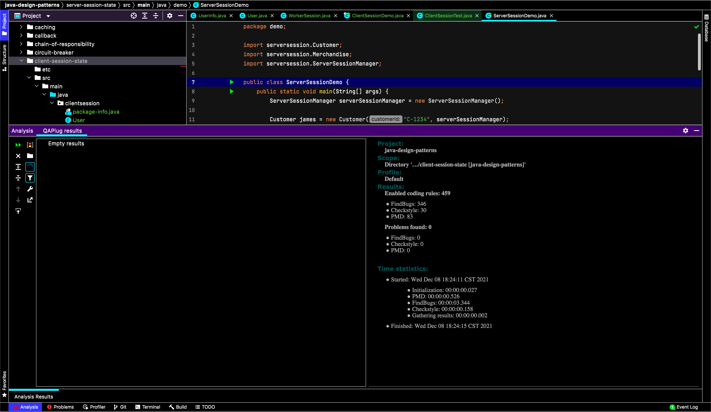

### FindBugs and PMD report
I installed the plugin QAPlug for Intellij.

Because the code for this issue is just a small part of a larger project, FindBugs and PMD were only run on
the client-session-state directory.

There are no warnings or errors.

Screenshot result:

### Note:
The settings for FindBugs are shown below:
