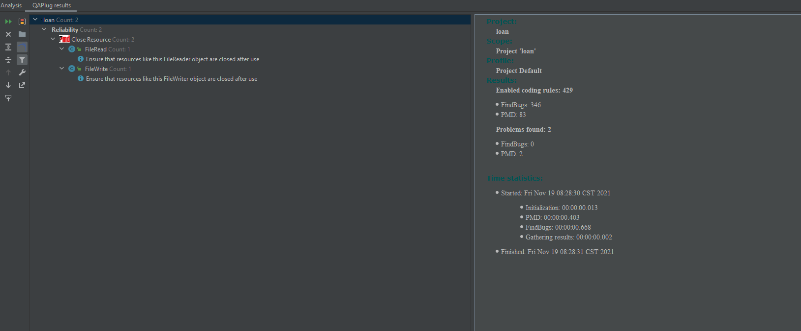

## FindBugs and PMD report

This is an feature issue of java design pattern project, so I only run the report for this feature's module.

I use an Intellij plugin - QAPlug to run Findbugs and PMD report.

There is no error.

HTML result: https://github.com/yus8yus8/java-design-patterns/blob/master/bulkhead/etc/qaplug_result.html

Screenshot result:

