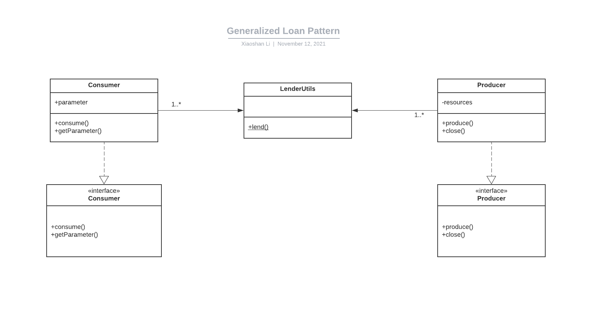

## Also known as

Lender/Lendee Pattern

## Intent
Loan pattern allows programmers to reuse the code of creating resources.
Based on the reference, I created a generalized loan pattern. Programmers only need to write new producers/consumers to use this pattern.

## Explanation

Loan Pattern Website says

> Loan pattern takes a “lending approach” i.e the code which keep hold of the resources “lends” if to the calling code. 
> The lender (a.k.a code which holds resources) manages the resources once the lendee (code accessing the resource) has used it (with no interest ).

 **How to use**

The following code shows the the Producer and Consumer interfaces and the LenderUtils. The producer is used to produce resources based 
on parameters passed by consumers. The resource will be passed to consumer through LenderUtils. 
Finally, the LenderUtils will close/release the resources. Programmers can call lend with producer object and consumer object.

```java
public interface Producer {
    <T> T produce(Object...parameters) throws LoanException;
    void close() throws LoanException;
}

public interface Consumer<T> {
    void consume(T resource) throws LoanException;
    Object[] getParameter() throws LoanException;
}

public class LenderUtils {
    public static <T> void lend(Producer producer, Consumer<T> consumer) throws LoanException{
            T resource = producer.produce(consumer.getParameter());
            consumer.consume(resource);
            producer.close();
    }
}
```


## Class diagram



## Credits

* [Loan pattern in Java (a.k.a lender lendee pattern)](https://www.javacodegeeks.com/2013/01/loan-pattern-in-java-a-k-a-lender-lendee-pattern.html)
