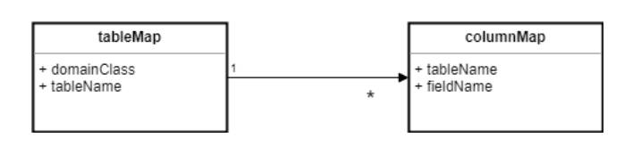

## Full Name

Object-Relational Metadata Mapping

## Intent

Metadata Mapping pattern provides a simple way for programmers to map objects to database data.

## Explanation
Patterns of Enterprise Application Architecture says

> Much of the code that deals with object-relational mapping describes how fields in the database correspond to fields in in-memory objects. The resulting code tends to be tedious and repetitive to write. A Metadata Mapping allows developers to define the mappings in a simple tabular form, which can then be processed by generic code to carry out the details of reading, inserting, and updating the data.

 **Core Files**
 
 DataMap.java ColumnMap.java
 
 **How to use**

You need to write your own mappers classes which use DataMap.java and ColumnMap.java to do the mapping from objects to database data. You can take a look at the StudentMapper.java, Student.java and App.java to see how to write the mappers and use this design pattern. Feel free to add more methods to support different kinds of sql statements.

## Class diagram

## Credits

* [Metadata Mapping Pattern](https://www.sourcecodeexamples.net/2018/04/metadata-mapping-pattern.html)
* [Patterns of Enterprise Application Architecture](https://www.amazon.com/Patterns-Enterprise-Application-Architecture-Martin/dp/0321127420/ref=asc_df_0321127420/?tag=hyprod-20&linkCode=df0&hvadid=312128454859&hvpos=&hvnetw=g&hvrand=15975451927881563630&hvpone=&hvptwo=&hvqmt=&hvdev=c&hvdvcmdl=&hvlocint=&hvlocphy=9022185&hvtargid=pla-422923047050&psc=1)
