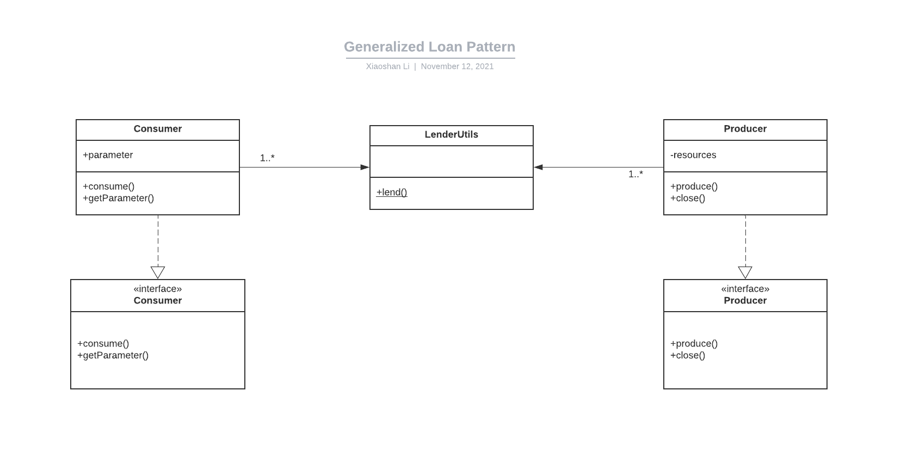

## Full Name

Object-Relational Metadata Mapping

## Intent

Metadata Mapping pattern provides a simple way for programmers to map objects to database data.

## Explanation
Patterns of Enterprise Application Architecture says

> Much of the code that deals with object-relational mapping describes how fields in the database correspond to fields in in-memory objects. The resulting code tends to be tedious and repetitive to write. A Metadata Mapping allows developers to define the mappings in a simple tabular form, which can then be processed by generic code to carry out the details of reading, inserting, and updating the data.

 **Core Files**
 
 DataMap.java ColumnMap.java
 
 **How to use**

You need to write your own mappers classes which use DataMap.java and ColumnMap.java to do the mapping from objects to database data. You can take a look at the StudentMapper.java, Student.java and App.java to see how to write the mappers and use this design pattern.

## Class diagram

## Credits

* [Loan pattern in Java (a.k.a lender lendee pattern)](https://www.javacodegeeks.com/2013/01/loan-pattern-in-java-a-k-a-lender-lendee-pattern.html)
